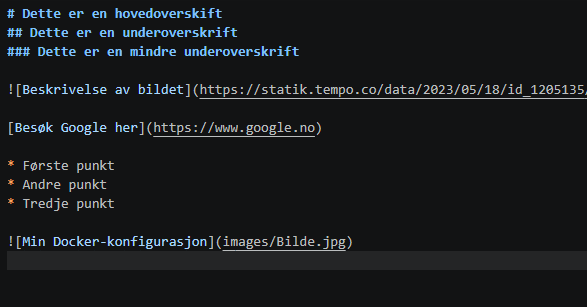

# Welcome to MkDocs

For full documentation visit [mkdocs.org](https://www.mkdocs.org).

## Commands

* `mkdocs new [dir-name]` - Create a new project.
* `mkdocs serve` - Start the live-reloading docs server.
* `mkdocs build` - Build the documentation site.
* `mkdocs -h` - Print help message and exit.

## Project layout

    mkdocs.yml    # The configuration file.
    docs/
        index.md  # The documentation homepage.
        ...       # Other markdown pages, images and other files.

Dette er **viktig** tekst.

Dette er ***ekstremt*** viktig.

# Dette er en hovedoverskift 
## Dette er en underoverskrift 
### Dette er en mindre underoverskrift 

[Besøk Google her](https://www.google.no)

* Første punkt
* Andre punkt
* Tredje punkt

